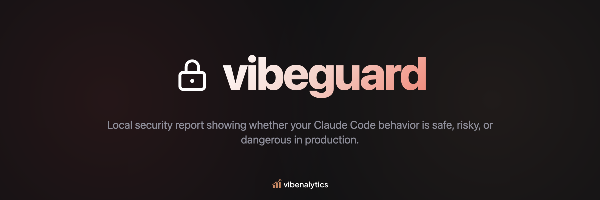
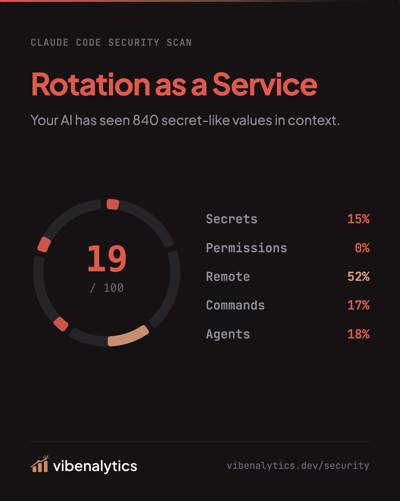

<p align="center">
  
</p>

<p align="center">
  Security audit and risk dashboard for Claude Code sessions.
</p>

<p align="center">
  
  
  
  
  
</p>

<p align="center">
  <a href="#install">Install</a>
  ·
  <a href="https://vibenalytics.dev/vibeguard">Website</a>
  ·
  <a href="https://vibenalytics.dev/vibeguard/sample">Sample Report</a>
  ·
  <a href="#what-you-get">What You Get</a>
  ·
  <a href="#persona-card">Persona Card</a>
  ·
  <a href="#report-sections">Report Sections</a>
  ·
  <a href="#how-it-works">How It Works</a>
</p>

---

Scans your local Claude Code transcripts and turns them into a visual security report: secret exposure in tool output, destructive command patterns, permission bypass habits, SSH activity, agent oversight gaps, and more.

Live product page: <https://vibenalytics.dev/vibeguard>  
Sample report: <https://vibenalytics.dev/vibeguard/sample>

<p align="center">
  
</p>

## Install

```bash
npx cc-vibeguard
```

That is the full install and run flow. `cc-vibeguard` scans `~/.claude/projects`, writes a self-contained HTML report to `~/Downloads/cc-vibeguard-report.html`, and opens it in your browser.

No data leaves your machine.

Requires Node.js 18+. Prebuilt binaries are available for macOS (ARM64, x64) and Linux (x64, ARM64).

Want to see the output first? Browse the sample report: <https://vibenalytics.dev/vibeguard/sample>

## What You Get

| Area | What it surfaces |
| --- | --- |
| Secret exposure | API keys, tokens, private keys, seed phrases, database URLs, and other sensitive values found in tool results |
| Destructive commands | Risky shell, SQL, git, cloud, infra, and package publishing actions with severity and context |
| Permission discipline | How often bypass mode is used, when it happens, and which projects carry the most risk |
| SSH and remote access | Hosts, command types, and a timeline of remote activity |
| Autonomous agents | Subagent usage, models used, and how often agents ran with elevated permissions |
| Human overrides | Denials, interrupts, and destructive command catches that prevented bad outcomes |
| User sentiment | Frustration and satisfaction signals across prompts |
| Security score | A weighted 0-100 score across secrets, permissions, remote access, commands, and agent oversight |
| Persona | A behavioral archetype based on your operating patterns, from highly disciplined to more adventurous |

## Why Teams Use It

- Spot real security drift in day-to-day AI-assisted development.
- See risky patterns across projects, not just one session at a time.
- Share a report that is readable by engineers, leads, and security-minded operators.
- Keep analysis fully local with no telemetry and no external uploads.

## Persona Card

<table>
  <tr>
    <td width="58%" valign="middle">
      <p>Every report ends with a downloadable persona card that brings together your archetype and key security signals in one polished, shareable snapshot.</p>
      <p>Celebrate strong habits, spot where your workflow could tighten up, and compare approaches across your team in a way that feels useful, lightweight, and a little fun.</p>
    </td>
    <td width="42%" valign="middle">
      
    </td>
  </tr>
</table>

## Report Sections

| Section | What it shows |
| --- | --- |
| Hero | Transcript count, project count, date range, and total prompts |
| Persona | Behavioral archetype with key stats |
| Scores | Overall security score plus per-dimension breakdown |
| Secret exposure | Secret types, most exposed keys, and exposure by project |
| Destructive commands | Severity distribution, categories, critical findings, and git safety |
| Permission discipline | Bypass rate, mode distribution by hour and day, and riskiest projects |
| SSH and remote access | Hosts, command count, and daily timeline |
| Autonomous agents | Spawn count, bypass-mode agents, and models used |
| Human overrides | Denials, interrupts, destructive catches, and most rejected tools |
| User sentiment | Negative and positive rates, top keywords, and per-project breakdown |
| Prioritized risks | Actionable risk items plus what is already working well |

## How It Works

1. Discover all `.jsonl` transcript files in `~/.claude/projects/`
2. Parse each session: user prompts, tool calls, tool results, and assistant responses
3. Run security analysis across all parsed sessions
4. Generate a self-contained HTML dashboard with the data embedded
5. Open the report in your browser

All analysis runs locally. No network requests. No telemetry.

## Built With

Rust CLI with prebuilt binaries distributed via npm optional dependencies.

## License

MIT
